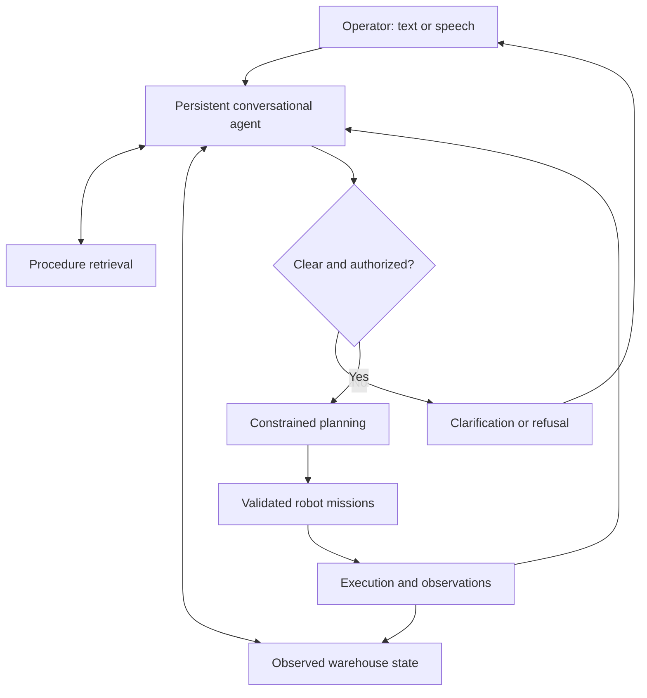

# Cooperative Warehouse Intelligence

**Conversational and agentic AI for coordinated action in dynamic warehouses.**

**Generative AI · Agentic AI · LLMs · RAG · Speech/NLP · Constrained Optimization · Reinforcement Learning · Robotics**

## The project in one minute

**Three mobile robots cooperate to transport goods in a warehouse while coordinating with human operators.** The target system accepts **written orders, recorded voice messages, and live spoken conversations through a robot microphone and speaker**. Operators can clarify a destination, correct an order, or request an authorized change in priority.

**Generative AI, LLMs, NLP, RAG, and agentic workflows form the conversational coordination layer.** They interpret instructions, retrieve applicable warehouse procedures, inspect observed state, and ask targeted follow-up questions when an order is ambiguous. The agent then submits a validated task to the execution layer and explains status using actual execution evidence.

The target warehouse is **dynamic, partially observable, and uncertain**: people and other robots move, aisles become blocked, new tasks arrive, batteries deplete, and observations become stale. Robots share observations and coordinate missions. **Constrained optimization** will support task allocation, routing, scheduling, and charging; **reinforcement learning** will study adaptive clarification and information-gathering decisions that support coordination under uncertainty.

**Implementation target:** the complete three-robot scenario above. **Working foundation today:** the text-to-task prototype described below. Speech, physical/simulated robot execution, optimization, and RL remain planned extensions; the current prototype does not move robots.

**Available now (M1):** runnable text-to-task API and offline demo, versioned lexical procedure retrieval, clarification and correction, deterministic policy checks, and explicit task confirmation. A local Ollama extraction adapter is implemented and contract-tested; live-model performance is not yet verified. [Run the demo](docs/development.md) · [Verification](docs/verification.md) · [Roadmap](docs/ROADMAP.md).

## Problem

Warehouse instructions often omit crucial details: which tote, which destination, whose instruction takes priority, or whether an exception is permitted. Meanwhile, aisle availability, robot batteries, station queues, and order priorities can change.

This project asks how a conversational agent can retrieve the right procedure, inspect current state, ask a useful question, and coordinate feasible action without inventing information or treating every request as executable.

## Capability status

| Capability | Status | Evidence or boundary |
| --- | --- | --- |
| Text-to-task conversation | Implemented | Clarification, corrections, confirmation, cancellation; local demo and API |
| Grounded retrieval | Implemented baseline | Five original synthetic procedures; lexical retrieval and versioned citations |
| LLM intent extraction | Experimental adapter | Local Ollama JSON-schema contract tested with mocked HTTP; live model evaluation pending |
| Agentic workflow | Implemented baseline | Bounded retrieve/extract/validate/confirm orchestration; in-memory state |
| Authorization and validation | Implemented demo guards | Server-configured role, destination, payload, known IDs, confirmation revalidation |
| Speech and fluent dialogue | Planned | Recorded/live speech, spoken replies, interruption handling, generated responses |
| Multi-robot warehouse | Planned | Three tote carriers, dynamic obstacles, partial observations, execution feedback |
| Constrained optimization | Planned | Assignment, scheduling, charging, and conflict-free route reservations |
| Reinforcement learning | Planned research | Clarification decisions versus fixed-rule baselines |

## Demonstration available now

Actual offline run, using the explicitly labeled rules baseline:

> **Operator:** Move the blue tote to P2
>
> **Coordinator:** Which tote do you mean? Observed: T17, T23.
>
> **Operator:** T17
>
> **Coordinator:** Confirm T17 from A to P2, normal priority? Reply 'confirm' or correct it.
>
> **Operator:** confirm
>
> **Coordinator:** Task specification accepted. Planning and robot dispatch are not implemented in M1; no robot has moved.

Every response includes the backend name, task state, evidence citations, workflow trace, and a dispatch flag. See [the captured transcript](assets/m1-demo.txt).

## Target voice and warehouse experience

The following is an **illustrative target interaction**, not a recorded demonstration:

> **Operator:** Take the blue tote to packing first.
>
> **Coordinator:** There are two blue totes at receiving. Do you mean T17 or T23, and which packing station?
>
> **Operator:** T17 to P2. Make it urgent.
>
> **Coordinator:** That would delay order 42. Should I apply your priority override?
>
> **Operator:** Yes.
>
> **Coordinator:** The task is accepted. I will check a route around the blocked aisle before dispatching a robot.

The target interfaces include text, timestamped recorded voice messages, and live microphone conversations with spoken replies. Physical face-to-face interaction requires later microphone/speaker integration and hardware validation. References such as “that one” require a known object selection or additional clarification; visual gesture understanding is outside the initial scope.

## Architecture

**Target architecture:** M1 implements text input, bounded conversation state, lexical retrieval, observed fixture lookup, authorization checks, and confirmation. Constrained planning and robot execution remain planned.



### Primary AI components

| Component | Intended responsibility |
| --- | --- |
| Generative AI / LLMs | Interpret requests and corrections; generate targeted questions and evidence-supported explanations. |
| Agentic orchestration | Persist conversations, call bounded tools, dispatch validated tasks, monitor execution, and recover from failures. |
| RAG | Retrieve applicable, versioned procedures and handling instructions with source attribution. |
| Speech / NLP | Transcribe voice messages, resolve task entities, manage conversational turns, and generate spoken replies. |

### Execution and research components

| Component | Intended responsibility |
| --- | --- |
| Optimization | Feasible task allocation, scheduling, route reservations, and charging decisions. |
| Reinforcement learning | An experimental clarification policy: ask, inspect more information, proceed with a validated task, or defer. |
| Robotics simulation | Three mobile robots transporting standardized totes under changing conditions and partial observations. |

One conversational coordinator invokes specialized tools; individual robots execute structured missions and share observations. Separate LLM instances per robot are not required. Live operational facts come from structured state tools, not from treating document retrieval as a real-time database.

## Target operational boundaries

- Operational overrides require an authorized issuer, scope, and expiry. They cannot override protective stopping, collision constraints, payload limits, or battery protection.
- Enforced rules have validated structured representations; retrieved prose does not automatically become an executable rule.
- Requested, accepted, scheduled, executing, and completed are distinct states. Completion requires execution evidence.
- Recorded commands require timestamps, expiry handling, and duplicate protection.
- The first simulation assumes standardized totes and station-based loading/unloading. Robot arms, forklifts, and physical deployment are outside the initial release scope.
- Unknown or stale observations remain uncertain; privileged simulator truth must not leak into the agent's operational observations.

## Design principles

**Language proposes; validated tools determine admissibility.** The LLM extracts task intent. It cannot assign itself permissions, relax payload limits, calculate route feasibility, or report unobserved task completion. The current deterministic guards cover the synthetic fixture; they are not a comprehensive safety system.

**Grounding has two sources.** RAG supplies procedural evidence; structured state supplies known tote identities and locations. Model-generated identifiers absent from operator text trigger clarification. Operator confirmation remains necessary because schema validity alone does not establish correct interpretation.

**Clarification is part of the task.** A correction invalidates the pending candidate, including when re-interpretation fails. Confirmation rechecks current fixture state and permissions. Accepted specifications do not imply scheduled or completed physical work.

**Evidence before claims.** Runnable behavior, adapter contracts, research hypotheses, and future capabilities have separate status labels. Reproducible engineering tests precede claims about task efficiency or model quality.

## Planned optimization and learning formulation

The physical planning extension will minimize priority-weighted lateness with secondary energy and travel costs:

$$
\min \mathbb{E}\left[\sum_j w_j\max(0,C_j-d_j)+\lambda_E E+\lambda_D D\right].
$$

Here, completion time is $C_j$, deadline is $d_j$, task priority weight is $w_j$, energy is $E$, and travel distance is $D$. Units, scaling, horizon, and tradeoff weights must be specified before experiments.

Constraints will cover task assignment, pickup-before-delivery, payload capacity, access permissions, charger capacity, energy reserves, and spatial/temporal route conflicts. Collision protection remains an independent execution responsibility under uncertain observations. This is a design formulation; no solver is implemented in M1.

The RL extension will study **ask, inspect, proceed with a validated task, or defer** decisions using observable dialogue and warehouse state. Rewards will penalize wrong actions, delays, and excessive operator interruptions. Hard authorization and protective constraints remain outside the learned policy. Baselines and held-out tasks must be fixed before reporting improvement.

## Research and evaluation

**Proposed primary question:** Can grounded conversational orchestration improve correct warehouse task execution under ambiguous instructions and changing conditions while limiting operator interruptions?

Candidate comparisons include structured forms, an LLM without RAG, RAG with fixed clarification rules, and an agent with a learned clarification policy. Comparisons should hold the execution backend and scenario distribution constant where applicable. Structured forms provide a reference for explicit task specification rather than a directly equivalent conversational interface.

Primary measures: correct task interpretation, retrieval relevance, evidence support, wrong-command execution, unauthorized override acceptance, clarification usefulness, questions per task, end-to-end success, recovery success, latency, and inference cost.

Operational measures: weighted lateness, throughput, travel, energy, collisions, near misses, and deadlocks. Speech evaluation includes task-critical identifier errors as well as transcription error rates.

**Engineering verification:** 35 tests pass locally, covering conversation scenarios, API validation, policy guards, retrieval filtering, and mocked model contracts. This is software verification, not an experimental performance claim. No RL, retrieval-quality, live-LLM, or human-user benchmark has been executed. Future reports must include baselines, seeds, held-out scenarios, model/configuration versions, uncertainty estimates, and limitations.

## Technology stack and planned extensions

| Layer | Candidate technology |
| --- | --- |
| API and validation | Implemented: Python 3.12, FastAPI, Pydantic |
| Stateful orchestration | Implemented: bounded in-memory workflow; planned: LangGraph persistence |
| LLM and speech | Local Ollama text adapter implemented; model validation and speech remain planned |
| Retrieval | Implemented: lexical overlap with versioned synthetic sources; hybrid/vector retrieval remains planned |
| Persistence | In-memory sessions now; SQLite persistence planned |
| Planning | Planned: OR-Tools CP-SAT and reservation-based route planning |
| Simulation and learning | Planned: Gymnasium-compatible environment and PyTorch RL experiments |
| Quality and reproducibility | pytest, Ruff, mypy, uv lockfile, and GitHub Actions workflow |

Installed dependencies are pinned in `pyproject.toml` and `uv.lock`. Planned technologies are not installed merely to appear in the stack.

## Getting started

Requirements: Python 3.12 and uv. From the repository root:

```sh
uv sync --locked
uv run cwi-demo
```

The demo uses a **rules baseline, not an LLM**, and resolves a blue-tote ambiguity before asking for explicit confirmation. See the [actual demo transcript](assets/m1-demo.txt).

For the authenticated local API, Windows PowerShell instructions, and optional Ollama setup, see [development instructions](docs/development.md). No model or paid API is needed for the offline demo. Speech, planning, and robot dispatch are not yet available.

## Repository structure

| Path | Purpose |
| --- | --- |
| `src/cwi/conversation/` | Intent, entities, dialogue state, corrections, and clarification. |
| `src/cwi/agents/` | Persistent orchestration, tool calls, and recovery. |
| `src/cwi/retrieval/` | Procedure ingestion, retrieval, filtering, and citations. |
| `src/cwi/speech/` | Recorded/live speech input and spoken responses. |
| `src/cwi/policy/` | Authorization, overrides, and structured rule enforcement. |
| `src/cwi/state/` | Tasks, observations, freshness, and execution events. |
| `src/cwi/planning/` | Assignment, scheduling, route reservations, and charging. |
| `src/cwi/simulation/` | Warehouse dynamics, observations, and robot execution. |
| `src/cwi/rl/` | Offline clarification-policy experiments. |
| `src/cwi/evaluation/` | Metrics, baselines, scenario replay, and reports. |
| `src/cwi/api/` | Operator and robot-facing service interfaces. |
| `configs/`, `data/`, `experiments/` | Configuration, synthetic fixtures, and experiment outlines. |
| `tests/` | Executable unit, API, scenario, and model-contract tests. |
| `docs/`, `assets/` | Design, roadmap, and future verified demonstrations. |

## Roadmap

1. **M1 — Text-to-task foundation:** available baseline and API; validate the local LLM on annotated instructions next.
2. **M2 — Dynamic warehouse execution:** accepted tasks become constrained missions for three simulated robots.
3. **M3 — Speech interaction:** recorded messages, live microphone turns, spoken replies, corrections, and noise evaluation.
4. **M4 — Reliable agentic operation:** persistent workflows, conflicts, execution recovery, and reconnect behavior.
5. **M5 — Research evaluation:** learned clarification, controlled ablations, operational metrics, and reproducible reports.
6. **M6 — Hardware preparation:** robot adapters, sensor/interface requirements, and a physical validation plan.

See [milestone completion criteria and known issues](docs/ROADMAP.md).

## API and reproducibility

| Route | Purpose |
| --- | --- |
| `GET /health` | Runtime/backend status; explicitly reports no robot dispatch |
| `POST /sessions` | Create a conversation for the configured demo operator |
| `POST /sessions/{session_id}/messages` | Submit an instruction, clarification, correction, confirmation, or cancellation |

Protected routes require `X-CWI-Token`. Credentials and role are configured by the server, not supplied as trusted fields in the request body. Start with a loopback binding and one worker; this is a local prototype.

```sh
uv run pytest -q
uv run ruff check .
uv run ruff format --check .
uv run mypy
```

[Verification notes](docs/verification.md) distinguish local test results from live-model and robotics validation. The CI workflow runs without model weights, secrets, or paid inference.

## Limitations and future work

M1 is a single-process text-to-task demo with synthetic inventory and procedures. The offline parser has a limited English grammar, responses use templates, and the Ollama adapter has not been tested against a live model here. Sessions do not survive restarts. Research novelty and performance improvements remain hypotheses. Warehouse noise, overlapping speech, uncertain localization, communication failures, load transfer, and human safety require explicit evaluation before hardware claims are appropriate.

Physical deployment would additionally require site-specific risk assessment, independent protective systems, suitable hardware, and validation with operators. Simulation outcomes do not establish deployment readiness.

## Author

[Mazyar Taghavi](https://github.com/mazyartaghavi) — project design and development.

See [contribution guidance](CONTRIBUTING.md) for milestone and evidence requirements. No software license has been selected; do not assume reuse permissions beyond those provided by applicable law.
