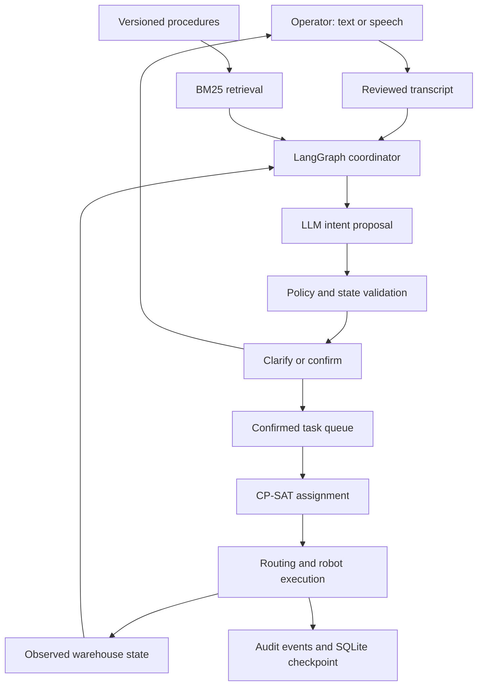

# Cooperative Warehouse Intelligence

**A GenAI system for coordinating three warehouse robots through grounded human conversations.**

[](https://github.com/mazyartaghavi/cooperative-warehouse-intelligence/actions/workflows/ci.yml)

Three mobile robots transport totes between storage and packing stations in a changing
warehouse. An operator can type an instruction, upload a voice message, or speak into
a microphone. The system retrieves warehouse procedures, interprets the request,
asks about ambiguous details, checks permissions, and presents the exact task for
confirmation. An optimizer assigns confirmed work to robots; the simulator coordinates
movement, discovers obstacles locally, replans routes, and accounts for battery use.

**The central engineering problem is the boundary between what a person means and
what a robot is permitted and able to do.** LLM output proposes a task; validated
state, explicit confirmation, and deterministic execution checks control dispatch.

This repository provides a runnable **simulation research prototype**. It includes a
local LLM adapter and optional local speech transcription. The offline demonstration
uses a clearly identified rules baseline. Physical robot deployment and live model
quality are separate validation requirements; neither is represented as completed.

## See the interaction

```text
Operator: Move the blue tote to P2.
Robot team: Which tote do you mean? Observed: T17, T23.
Operator: T17.
Robot team: Confirm T17 from A to P2, normal priority?
Operator: Confirm.
Robot team: Task queued for simulated robot execution.

The optimizer assigns a robot. A newly sensed obstacle updates the shared map.
The robot reroutes, picks up T17, delivers it to P2, and returns to its charger.
```

Two more conversations—`Move T23 to P1` and `Move T42 to P2`—engage the other robots.
The dashboard shows positions, battery levels, job progress, evidence citations,
and events. Its environment controls add or remove obstacles without revealing the
change to the planner until a robot observes it.

## Run it locally

Requirements: Python 3.12 and [uv](https://docs.astral.sh/uv/getting-started/installation/).
The default demonstration needs no API key, model download, microphone, or robot hardware.

```bash
git clone https://github.com/mazyartaghavi/cooperative-warehouse-intelligence.git
cd cooperative-warehouse-intelligence
uv sync --locked
uv run cwi-demo
```

Start the dashboard on **http://127.0.0.1:8000**:

```bash
export CWI_API_TOKEN="$(python -c 'import secrets; print(secrets.token_urlsafe(24))')"
uv run uvicorn cwi.api.app:app_factory --factory --host 127.0.0.1 --port 8000 --workers 1
```

Enter the same token in the dashboard. Choose a local token you can paste, or print
your generated token privately before starting the server. It represents one demo
operator; it is not a GitHub or model-provider credential.

For PowerShell:

```powershell
$env:CWI_API_TOKEN = "choose-a-private-local-token-of-at-least-16-characters"
uv run uvicorn cwi.api.app:app_factory --factory --host 127.0.0.1 --port 8000 --workers 1
```

Click **Connect**, send `Move the blue tote to P2`, clarify `T17`, and confirm. Click
**Run simulation** to advance time. `.env.example` documents settings; environment
files are not loaded automatically. [Development guide](docs/development.md).

## What each technology does

| Field | Implemented role | Boundary |
|---|---|---|
| **Generative AI / LLMs** | Local Ollama adapter extracts schema-constrained transport intents and generates answers from retrieved procedures | Model responses are untrusted; no direct robot commands |
| **Agentic workflows** | LangGraph retrieves evidence, proposes intent, and invokes policy validation; a durable conversation manages clarification and confirmation | Bounded coordinator graph, not three independent conversational LLMs |
| **RAG** | BM25 retrieves active, warehouse-scoped procedure records from a versioned SQLite corpus; answers carry source IDs, versions, and excerpts | Small synthetic corpus; no claim of a production knowledge base |
| **Speech / NLP** | Microphone and file capture, optional faster-whisper transcription, transcript review, browser text-to-speech | Speech requires local model files; browser voices may depend on the operating system |
| **Optimization** | OR-Tools CP-SAT task assignment with feasibility checks and travel/lateness costs; repeated grid routing and conservative reservations | Optimality concerns the bounded assignment problem, not the full warehouse schedule |
| **Robotics** | Three robot state machines, tote pickup/delivery, shared local observations, dynamic obstacles, battery use and charging | Discrete 2D simulation; no hardware driver or physics engine |
| **Reinforcement learning** | Seeded Q-learning for uncertainty resolution, connected to blocked-aisle inspection or operator feedback; two fixed-policy baselines | Synthetic training model; deployed inspection decisions retain independent energy and resource guards |

The offline rules parser is a reproducibility baseline, **not an LLM**. Select the
Ollama backend to exercise generative inference. A model failure returns an error;
the service does not quietly switch to rules and label the result as generated.

## Enable the LLM and voice paths

With Ollama running locally and a model already installed:

```bash
export CWI_BACKEND=ollama
export CWI_OLLAMA_MODEL=your-installed-model-name
# Restart the API with the same startup command.
```

The endpoint must be local. Both intent extraction and procedure Q&A use structured
outputs. A schema and valid citation IDs do not establish semantic correctness;
operators review grounded task details before confirming.

To enable recorded messages and live microphone utterances:

```bash
uv sync --locked --extra voice
export CWI_WHISPER_MODEL=/absolute/path/to/local/faster-whisper-model
# Restart the API. Recording requires localhost or HTTPS and microphone permission.
```

Models are not downloaded automatically. Recordings are limited to 60 seconds and
10 MiB; temporary decoding files are removed. A transcript goes into the instruction
box for review, then follows the same clarification and confirmation process as
text. The browser can read replies aloud. This is turn-based spoken interaction,
not always-listening, full-duplex voice or visual face recognition.

## Architecture



The simulation starts with known stations and inventory, including two blue totes.
Dynamic obstacles are partially observable: robots sense their adjacent cells and
share discoveries. Unknown space is provisionally traversable; immediate sensing
precedes movement. Active inspection can extend sensing to radius three when routing is blocked, at an energy cost. Every move respects occupied starting cells and reserved target
cells, so robots cannot occupy one cell or swap positions in a tick.

[Architecture and state ownership](docs/architecture/README.md) ·
[Warehouse model](docs/warehouse-execution.md) ·
[Research formulation](docs/research/README.md)

## Operational rules

- **Ambiguity:** unknown tote IDs, multiple blue totes, and missing destinations
  require clarification. An LLM cannot invent an unmentioned explicit ID.
- **Confirmation:** a correction invalidates the earlier proposal. State and
  authorization are checked again when the operator confirms.
- **Authority:** the server assigns the role. Supervisors can request urgent
  priority or transport to Q1. Chat messages cannot grant supervisor privileges.
- **Hard constraints:** the 50 kg payload ceiling and movement protection cannot
  be overridden by operator language. T31 is deliberately overweight for rejection tests.
- **Coordination:** one active transport per tote, one job per robot, and an
  idempotency key prevent duplicate work. Accepted is distinct from delivered.
- **Energy:** assignment budgets pickup, delivery, charger return, and reserve.
  Charging occupies the robot's dedicated home cell. New detours can invalidate
  initial estimates; this prototype does not prove recursive energy feasibility.
- **Persistence:** sessions, pending confirmations, jobs, robots, and environment
  state share a SQLite checkpoint. Run one API worker with one configured operator.

Procedure text supports interpretation and explanation. Deterministic Python policy
remains authoritative. Changing prose in the database does not silently rewrite
access control or protective behavior.

## Experiments and evidence

```bash
uv run cwi-evaluate --output outputs/evaluation.json --policy outputs/clarification-policy.json
uv run pytest -q
uv run ruff check .
uv run ruff format --check .
uv run mypy
```

[Recorded evaluation output](assets/evaluation.json) includes:

- Static and dynamic warehouse scenarios with all three tote deliveries completed.
- Actual distance, waiting, lateness, local observations, and conversation transcripts.
- A five-query retrieval sanity check over the synthetic corpus.
- Five training seeds for tabular Q-learning, 5,000 training episodes per seed,
  and 1,000 evaluation episodes per seed, with mean and sample standard deviation.
- Comparisons with `always_ask` and `inspect_when_possible` clarification policies.

The learning experiment uses assumed inspection reliability and human interruption
costs. Its returns are **synthetic reward units**, not warehouse productivity gains.
Select `CWI_ASSISTANCE_POLICY=q_learning` to use the packaged learned policy for blocked-route assistance. The default is `inspect_when_possible`.

A strong inspection heuristic is an essential comparator: beating `always_ask`
alone does not establish that learning is necessary.

Optional live model evaluation:

```bash
uv run cwi-evaluate-llm --model your-installed-model-name --output outputs/live-language.json
```

This command records the actual model, responses, errors, latency, and exact-case
accuracy. No live model score is published without an actual run.
[Verification record and limitations](docs/verification.md).

## Repository guide

| Location | Contents |
|---|---|
| `src/cwi/agents` | Bounded graph and durable conversation service |
| `src/cwi/conversation` | Typed task contracts, baseline/LLM adapters, grounded Q&A |
| `src/cwi/retrieval` | Active-version filtering and BM25 retrieval |
| `src/cwi/policy` | Authorization, ambiguity and payload guards |
| `src/cwi/planning` | CP-SAT assignment and grid routing |
| `src/cwi/simulation` | Three-robot environment, observations, execution and metrics |
| `src/cwi/state` | Warehouse records and SQLite persistence |
| `src/cwi/speech` | Optional local speech transcription |
| `src/cwi/api` | Authenticated API and browser dashboard |
| `src/cwi/rl` | Masked clarification environment and Q-learning |
| `src/cwi/evaluation` | Reproducible warehouse, retrieval and language experiments |
| `tests` | Behavioral, integration, persistence and model-contract tests |
| `docs` | Architecture, mathematical formulation, development and verification |
| `assets` | Recorded synthetic experiments and learned policy artifact |

## Research and engineering questions

1. Can retrieval-grounded structured generation reduce invalid task proposals
   compared with a rules baseline and an LLM without retrieved evidence?
2. When should a coordinator ask a human versus acquire another observation?
   Does learning improve on a well-designed fixed inspection policy?
3. How do partial observations and conservative movement reservations affect
   delay, energy expenditure, and throughput under changing layouts?

The repository supplies the experimental foundation; it does not claim a novel
algorithm, statistical superiority on real warehouses, or a publishable result
without further controlled experiments and independent evidence.

## From simulation to a warehouse

A real deployment needs robot-specific localization and sensing, continuous-time
motion planning, braking-distance and human-separation constraints, protected
stop hardware, payload/docking validation, warehouse-management integration,
operator identity management, noisy-speech evaluation, and hardware-in-the-loop
trials. Networking delays, stale observations, deadlocks, blocked chargers, and
interrupted missions need measured recovery behavior. These are substantial
engineering tasks, not configuration switches in this simulator.

The present prototype uses standard totes and fixed pickup/delivery stations.
It does not implement arbitrary-object grasping, a ROS 2/Nav2 driver, SLAM,
production authentication, or certified industrial safety functions.

[Development and deployment](docs/development.md) ·
[Milestones and remaining validation](docs/ROADMAP.md) ·
[Contribution guide](CONTRIBUTING.md)

## Technical references

- [LangGraph graph API](https://docs.langchain.com/oss/python/langgraph/graph-api)
- [OR-Tools assignment modeling](https://developers.google.com/optimization/assignment/assignment_example)
- [Ollama structured outputs](https://docs.ollama.com/capabilities/structured-outputs)
- [faster-whisper](https://github.com/SYSTRAN/faster-whisper)

Created by [Mazyar Taghavi](https://github.com/mazyartaghavi).
