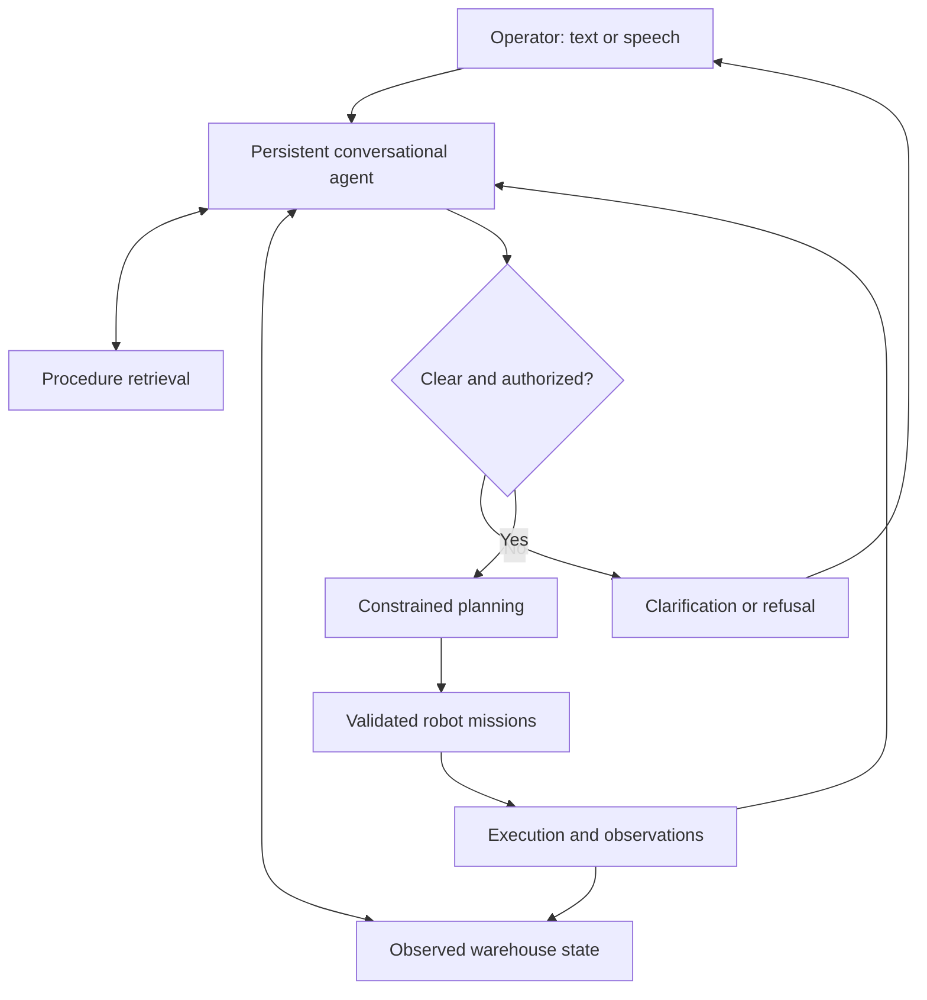

# Cooperative Warehouse Intelligence

**Conversational and agentic AI for coordinated action in dynamic warehouses.**

**Generative AI · Agentic AI · LLMs · RAG · Speech/NLP · Constrained Optimization · Reinforcement Learning · Robotics**

Cooperative Warehouse Intelligence explores how human operators can direct cooperating mobile robots through text and speech. Its central challenge is turning natural-language requests into grounded, unambiguous, authorized tasks—and maintaining that agreement when the warehouse changes.

The design connects conversational AI and procedure retrieval with planning, execution feedback, and human clarification. A partially observable warehouse provides an operational setting in which language decisions have measurable consequences: correct deliveries, conflicting priorities, delays, and recovery from blocked routes.

**Repository contents:** project specification and module scaffold. Executable capabilities, demonstrations, and experimental results are not included in this snapshot. [Capability status and roadmap](docs/ROADMAP.md).

## Problem

Warehouse instructions often omit crucial details: which tote, which destination, whose instruction takes priority, or whether an exception is permitted. Meanwhile, aisle availability, robot batteries, station queues, and order priorities can change.

This project asks how a conversational agent can retrieve the right procedure, inspect current state, ask a useful question, and coordinate feasible action without inventing information or treating every request as executable.

## Intended operator experience

The following is an **illustrative target interaction**, not a recorded demonstration:

> **Operator:** Take the blue tote to packing first.
>
> **Coordinator:** There are two blue totes at receiving. Do you mean T17 or T23, and which packing station?
>
> **Operator:** T17 to P2. Make it urgent.
>
> **Coordinator:** That would delay order 42. Should I apply your priority override?
>
> **Operator:** Yes.
>
> **Coordinator:** The task is accepted. I will check a route around the blocked aisle before dispatching a robot.

The target interfaces include text, timestamped recorded voice messages, and live microphone conversations with spoken replies. Physical face-to-face interaction requires later microphone/speaker integration and hardware validation. References such as “that one” require a known object selection or additional clarification; visual gesture understanding is outside the initial scope.

## Architecture

**Design architecture — components below are planned.**

### Primary AI components

| Component | Intended responsibility |
| --- | --- |
| Generative AI / LLMs | Interpret requests and corrections; generate targeted questions and evidence-supported explanations. |
| Agentic orchestration | Persist conversations, call bounded tools, dispatch validated tasks, monitor execution, and recover from failures. |
| RAG | Retrieve applicable, versioned procedures and handling instructions with source attribution. |
| Speech / NLP | Transcribe voice messages, resolve task entities, manage conversational turns, and generate spoken replies. |

### Execution and research components

| Component | Intended responsibility |
| --- | --- |
| Optimization | Feasible task allocation, scheduling, route reservations, and charging decisions. |
| Reinforcement learning | An experimental clarification policy: ask, inspect more information, proceed with a validated task, or defer. |
| Robotics simulation | Three mobile robots transporting standardized totes under changing conditions and partial observations. |

One conversational coordinator invokes specialized tools; individual robots execute structured missions and share observations. Separate LLM instances per robot are not required. Live operational facts come from structured state tools, not from treating document retrieval as a real-time database.

## Operational boundaries

- Operational overrides require an authorized issuer, scope, and expiry. They cannot override protective stopping, collision constraints, payload limits, or battery protection.
- Enforced rules have validated structured representations; retrieved prose does not automatically become an executable rule.
- Requested, accepted, scheduled, executing, and completed are distinct states. Completion requires execution evidence.
- Recorded commands require timestamps, expiry handling, and duplicate protection.
- The first simulation assumes standardized totes and station-based loading/unloading. Robot arms, forklifts, and physical deployment are outside the initial release scope.
- Unknown or stale observations remain uncertain; privileged simulator truth must not leak into the agent's operational observations.

## Research and evaluation

**Proposed primary question:** Can grounded conversational orchestration improve correct warehouse task execution under ambiguous instructions and changing conditions while limiting operator interruptions?

Candidate comparisons include structured forms, an LLM without RAG, RAG with fixed clarification rules, and an agent with a learned clarification policy. Comparisons should hold the execution backend and scenario distribution constant where applicable. Structured forms provide a reference for explicit task specification rather than a directly equivalent conversational interface.

Primary measures: correct task interpretation, retrieval relevance, evidence support, wrong-command execution, unauthorized override acceptance, clarification usefulness, questions per task, end-to-end success, recovery success, latency, and inference cost.

Operational measures: weighted lateness, throughput, travel, energy, collisions, near misses, and deadlocks. Speech evaluation includes task-critical identifier errors as well as transcription error rates.

**Results:** No experiments or benchmarks have been executed. Future reports must include baselines, seeds, held-out scenarios, model/configuration versions, uncertainty estimates, and limitations. Simulated operator evaluations and human evaluations must be reported separately.

## Proposed technology stack

| Layer | Candidate technology |
| --- | --- |
| API and validation | Python, FastAPI, Pydantic |
| Stateful orchestration | LangGraph |
| LLM and speech | Replaceable local or hosted model adapters; model selection pending measured quality, latency, and cost |
| Retrieval | Hybrid lexical/vector retrieval with permission and version filters; vector backend to be selected |
| Persistence | SQLite initially |
| Planning | OR-Tools CP-SAT for discrete scheduling, with reservation-based route planning |
| Simulation and learning | Gymnasium-compatible warehouse environment; PyTorch for later RL experiments |
| Quality and reproducibility | pytest, Ruff, type checking, pinned dependencies, and GitHub Actions when executable components exist |

These are design choices, not installed dependencies. Frameworks and model versions will be verified and pinned when the corresponding milestone is implemented.

## Getting started

Read [the roadmap](docs/ROADMAP.md), [the design outline](docs/architecture/README.md), and [the research outline](docs/research/README.md). Module directories contain purpose and completion criteria rather than executable stubs.

There is no installation command, application entry point, or runnable demo in this snapshot. Verified setup instructions will accompany the first executable milestone. No credentials or paid service subscriptions are needed to review these documents.

## Repository structure

| Path | Purpose |
| --- | --- |
| `src/cwi/conversation/` | Intent, entities, dialogue state, corrections, and clarification. |
| `src/cwi/agents/` | Persistent orchestration, tool calls, and recovery. |
| `src/cwi/retrieval/` | Procedure ingestion, retrieval, filtering, and citations. |
| `src/cwi/speech/` | Recorded/live speech input and spoken responses. |
| `src/cwi/policy/` | Authorization, overrides, and structured rule enforcement. |
| `src/cwi/state/` | Tasks, observations, freshness, and execution events. |
| `src/cwi/planning/` | Assignment, scheduling, route reservations, and charging. |
| `src/cwi/simulation/` | Warehouse dynamics, observations, and robot execution. |
| `src/cwi/rl/` | Offline clarification-policy experiments. |
| `src/cwi/evaluation/` | Metrics, baselines, scenario replay, and reports. |
| `src/cwi/api/` | Operator and robot-facing service interfaces. |
| `configs/`, `data/`, `experiments/` | Configuration, synthetic fixtures, and experiment outlines. |
| `tests/` | Future unit, integration, and scenario validation. |
| `docs/`, `assets/` | Design, roadmap, and future verified demonstrations. |

## Limitations and future work

The current contribution is the specification and scaffold. Research novelty and performance improvements remain hypotheses. Warehouse noise, overlapping speech, uncertain localization, communication failures, load transfer, and human safety require explicit evaluation before hardware claims are appropriate.

Physical deployment would additionally require site-specific risk assessment, independent protective systems, suitable hardware, and validation with operators. Simulation outcomes do not establish deployment readiness.

## Author

[Mazyar Taghavi](https://github.com/mazyartaghavi) — project design and development.

See [contribution guidance](CONTRIBUTING.md) for milestone and evidence requirements. No software license is selected in this scaffold; do not assume reuse permissions beyond those provided by applicable law.
